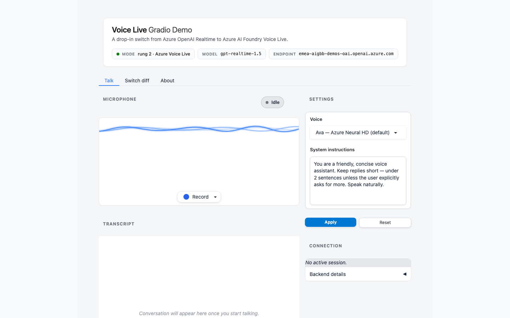

# Voice Live Gradio Demo — May 2026 GA Refresh

> **How trivial is it to switch from Azure OpenAI Realtime to Azure AI Foundry
> Voice Live?** Three lines, same SDK. This repo proves it — three sibling
> apps that share **all** their plumbing and differ **only** in the
> connection-setup block.



## What's in the box

```
voice-live-gradio/
├── app_realtime.py        ← rung 1: Azure OpenAI Realtime  (the "before")
│      │
│      ▼   diff = 3 small lines (api-version, websocket_base_url, extra_query)
├── app_voicelive.py       ← rung 2: Azure Voice Live       (the punchline)
│      │
│      ▼   diff = 1 line (extra_query gains agent-id / -project-name / -access-token)
├── app_agent.py           ← rung 3: Voice Live + Foundry Agent
├── app.py                 ← thin dispatcher (reads MODE env var)
└── voicelive_demo/        ← all shared plumbing — UI, handler, diff renderer
```

Open the running UI and click **🧩 View the diff** for a side-by-side render
of the two diffs above. The "trivial switch" is literally on screen.

## The diff, condensed

```python
# rung 1 — Azure OpenAI Realtime
client = AsyncAzureOpenAI(
    azure_endpoint=settings.azure_endpoint,
    api_version="2025-04-01-preview",                       # ← preview today
    azure_ad_token_provider=azure_ad_token_provider,
)
return client.realtime.connect(model=settings.azure_deployment_name)

# rung 2 — Azure AI Foundry Voice Live  (3 added/changed lines)
client = AsyncAzureOpenAI(
    azure_endpoint=settings.azure_endpoint,
    api_version="2025-10-01",                               # ← GA
    azure_ad_token_provider=azure_ad_token_provider,
    websocket_base_url=settings.azure_voice_live_endpoint,  # ← /voice-live
)
return client.realtime.connect(
    model=settings.azure_deployment_name,
    extra_query={"model": settings.azure_deployment_name},  # ← &model= not &deployment=
)

# rung 3 — Voice Live + Foundry Agent  (extra_query gets 3 routing keys)
return client.realtime.connect(
    model=settings.azure_deployment_name,
    extra_query={
        "agent-id":           settings.agent_id,
        "agent-project-name": settings.agent_project_name,
        "agent-access-token": await azure_agent_token_provider(),
    },
)
```

Everything else — the FastRTC mic pipe, the Gradio Blocks UI, the status
badges, the voice picker, the transcript fan-out — lives in
`voicelive_demo/` and is **identical across all three rungs**.

## Where to learn more

This repo is a *running demo* — it shows the three rungs side by side
so you can feel the differences in the UI and read the ~10 lines that
change between them. For the canonical platform / SDK / pricing
documentation, go straight to the source:

- [Voice Live API — overview](https://learn.microsoft.com/azure/ai-services/speech-service/voice-live) — what Voice Live is, what components it provides, supported regions and models
- [Voice Live API — how to use](https://learn.microsoft.com/azure/ai-services/speech-service/voice-live-how-to) — session config, turn detection, audio streaming, conversation state
- [Voice Live API — reference (2025-10-01)](https://learn.microsoft.com/azure/ai-services/speech-service/voice-live-api-reference-2025-10-01) — exact event schema
- [Azure OpenAI Realtime audio — concepts](https://learn.microsoft.com/azure/ai-services/openai/concepts/realtime-audio) · [how-to](https://learn.microsoft.com/azure/ai-services/openai/how-to/realtime-audio) — the underlying realtime model API
- [Azure AI Foundry — pricing](https://azure.microsoft.com/pricing/details/ai-foundry/) — line items for the model and the Voice Live server-side components

Open the **Switch** tab in the running UI to compare
[`voicelive_demo/rungs/realtime.py`](voicelive_demo/rungs/realtime.py)
and [`voicelive_demo/rungs/voicelive.py`](voicelive_demo/rungs/voicelive.py)
side-by-side, then run [`benchmark/run.py`](benchmark/README.md) for
measured latency under your own load.

## Why are there 3 lines, not 1?

The original demo claimed "one line — just `websocket_base_url`". As of May
2026 that's *almost* still true:

1. **`websocket_base_url`** — yes, still the headline change.
2. **`api_version` differs** between rungs because Realtime is still on
   `2025-04-01-preview` (the `openai 2.x` SDK keeps emitting
   `/openai/realtime` — when it adopts the GA `/openai/v1/realtime` URL we
   can collapse this difference). Voice Live is **GA** on `2025-10-01`.
3. **`extra_query={"model": ...}`** — the SDK adds `&deployment=…` to the
   WSS URL; Voice Live keys off `&model=…`, so we add it explicitly. Tiny.

## Models in play

| Deployment | Version | Used by | Notes |
|---|---|---|---|
| `gpt-realtime-1.5` | `2026-02-23` | **All three rungs (default)** | The newest model Voice Live serves in Sweden Central as of May 2026 — keeps the cross-rung diff symmetric. |
| `gpt-realtime-2` | `2026-05-06` | Optional override for rung 1 | The newest realtime model anywhere. Voice Live's hosted menu hasn't picked it up yet; will move all 3 rungs to it the day it lands. |

> Voice Live additionally hosts a curated allow-list of **managed** models
> you don't have to deploy yourself (`gpt-realtime`, `gpt-realtime-mini`,
> `gpt-5-mini`, `gpt-4o-mini`, …). The unified switcher and the
> benchmark reach these through the same `extra_query={"model": …}` knob —
> no Foundry-side change required.

## Getting started

### Prerequisites

- Python `>=3.13`
- [`uv`](https://docs.astral.sh/uv/getting-started/installation/) and `ffmpeg` (for PyAV / FastRTC's WebRTC pipe)
- An Azure AI Foundry resource in a [Voice-Live-supported region](https://learn.microsoft.com/azure/ai-services/speech-service/regions?tabs=voice-live#regions)
  with `gpt-realtime-1.5` (or any realtime model the region serves) deployed
- An Entra ID identity with `Cognitive Services User` on the Foundry
  resource — **no API keys** anywhere
- (Optional, agent rung only) a Foundry Agent provisioned in the same project

### Quickstart

```bash
git clone https://github.com/unsafecode/voice-live-gradio
cd voice-live-gradio
cp .env.example .env       # edit endpoint + deployment, (optional) agent vars
uv sync
az login                   # add --tenant <id> if your account spans multiple tenants
uv run app.py              # serves http://localhost:7860 by default
```

Open `http://localhost:7860` in a browser, grant mic permission, click the
mic to (re)connect, talk.

### Configuration

Every setting is environment-driven — `.env.example` is the source of
truth and `voicelive_demo/config.py` is the schema. Nothing in the source
is environment-specific.

| Variable | Default | What it does |
|---|---|---|
| `MODE` | `demo` | `demo` (unified switcher) · `realtime` · `voicelive` · `agent` |
| `AZURE_OPENAI_ENDPOINT` | **required** | `https://<resource>.openai.azure.com` |
| `AZURE_VOICELIVE_ENDPOINT` | **required** | `wss://<resource>.services.ai.azure.com/voice-live` |
| `AZURE_OPENAI_DEPLOYMENT_NAME` | `gpt-realtime-1.5` | The realtime model deployment name in your Foundry resource |
| `AZURE_OPENAI_API_VERSION` | `2025-04-01-preview` | Realtime API version (preview today, GA when openai 2.x adopts the GA URL) |
| `AZURE_VOICELIVE_API_VERSION` | `2025-10-01` | Voice Live GA API version |
| `AGENT_ID` / `AGENT_PROJECT_NAME` | unset | Required only for the Agent rung; rung auto-hides when blank |
| `AZURE_COGNITIVE_SERVICES_SCOPE` | `https://cognitiveservices.azure.com/.default` | Token audience for the model. Override for sovereign clouds (Gov / China / Germany) |
| `AZURE_AI_SCOPE` | `https://ai.azure.com/.default` | Token audience for the Foundry Agent rung. Override for sovereign clouds |
| `HOST` | `0.0.0.0` | Gradio bind address. Use `127.0.0.1` for loopback-only |
| `PORT` | `7860` | Gradio TCP port. Bump if 7860 is taken |

### Switching rungs

By default `uv run app.py` boots the **unified switcher** — all three
rungs reachable from one UI via a segmented control in the header. Click
a rung, click the mic to (re)connect, the next WebSocket lands at the
new destination. No restart.

```bash
uv run app.py                    # unified switcher (default — MODE=demo)
MODE=realtime   uv run app.py    # single-mode: Azure OpenAI Realtime
MODE=voicelive  uv run app.py    # single-mode: Azure Voice Live
MODE=agent      uv run app.py    # single-mode: Voice Live + Foundry Agent
```

You can also set `MODE` in `.env` and just run `uv run app.py`. Or run
any single-mode shell directly: `uv run app_voicelive.py`. They all
share the same `connect_factory` / `make_session` callables — defined
once in `voicelive_demo/rungs/{realtime,voicelive,agent}.py` — so the
unified switcher and the **Switch diff** tab stay in lockstep with what
each shell actually runs.

The Agent rung is auto-disabled in the unified switcher if `AGENT_ID`
and `AGENT_PROJECT_NAME` aren't set in `.env`.

## What's new in the UI

- **Header chip** — at-a-glance MODE / MODEL / ENDPOINT.
- **Language switcher** — top-right of the hero. Swaps the interface
  (labels, buttons, status pill, blurbs, diff cards, About) **and** the
  voice + transcription language atomically. English + Italian ship in
  the box; add a third in ~10 lines (see [Localization](#localization)).
- **Live status** — Idle → Connecting → Listening 🎙️ → Thinking → Speaking 🔊 → Error.
- **Voice picker** — curated Azure Neural HD + OpenAI voices per locale;
  applies on next session.
- **System instructions** field — tweak persona without editing code.
- **Reset conversation** — clears the transcript.
- **Connection details panel** — endpoint, WSS URL, mode, auth method.
- **🧩 View the diff tab** — renders the two diffs above with `difflib.HtmlDiff`,
  computed from the live source files.
- **ℹ️ About tab** — what each rung does and where it sits on the GA
  timeline.

## Localization

The interface and the model's voice + transcription language are wired
together so visitors see (and hear) one consistent experience. All
strings, voice option lists, and per-locale system-prompt defaults live
in [`voicelive_demo/i18n.py`](voicelive_demo/i18n.py). Ships with:

- 🇬🇧 **English** — DragonHD voices (Ava, Andrew, Emma, Brian, Aria, Davis) + OpenAI Marin/Cedar.
- 🇮🇹 **Italian** — Multilingual Neural voices (Isabella, Giuseppe, Alessio) + standard Neural (Marta, Diego, Elsa) + OpenAI Nova/Shimmer.

Adding a new locale is one entry per dict in `i18n.py`
(`LOCALES`, `VOICE_OPTIONS`, `DEFAULT_VOICE`, `DEFAULT_INSTRUCTIONS`,
`STRINGS`, `STATUS_LABELS`, `RUNG_BLURBS`, plus a `diff_section1_*` /
`diff_section2_*` block in `STRINGS`). The pill switcher auto-renders
one button per `LOCALES` entry. The active locale is passed straight
into `session.input_audio_transcription.language` so the model
transcribes in the right language regardless of accent.

## Auth

Everything is **Entra ID** via `azure.identity.aio.DefaultAzureCredential`:

- Realtime + Voice Live model scope: `https://cognitiveservices.azure.com/.default`
- Foundry Agent scope: `https://ai.azure.com/.default`

No API keys are present in `.env.example` or anywhere in the source.

## Benchmark

Want real numbers? `benchmark/run.py` runs a **scenario matrix**
(mode × model) × `--iterations` × `--turns` over the *exact same*
conversation and emits a markdown report with p50 / p95 / CoV% plus
per-turn WAVs. The default matrix exercises the Realtime baseline
**and** Voice Live's hosted realtime *and* text-model flavours so you
can see the TTS-overlay tax in one chart.

```bash
uv run python -m benchmark.run                       # default 5-scenario matrix, 3 iter × 4 turns
uv run python -m benchmark.run --iterations 5        # tighter PAYG noise absorption
uv run python -m benchmark.run --scenarios voicelive:gpt-5-mini voicelive:gpt-4o-mini
```

See [`benchmark/README.md`](benchmark/README.md) for the full matrix
syntax, output layout, and caveats.

## Resources

- [Voice Live overview](https://learn.microsoft.com/azure/ai-services/speech-service/voice-live)
- [Voice Live quickstart (Foundry models)](https://learn.microsoft.com/azure/ai-services/speech-service/voice-live-quickstart?tabs=windows%2Ckeyless&pivots=programming-language-python)
- [Voice Live quickstart (Foundry Agents)](https://learn.microsoft.com/azure/ai-services/speech-service/voice-live-agents-quickstart?tabs=windows%2Ckeyless&pivots=programming-language-python)
- [Regional availability](https://learn.microsoft.com/azure/ai-services/speech-service/regions?tabs=voice-live#regions)
- [Original FastRTC adapter sample](https://huggingface.co/spaces/fastrtc/talk-to-openai/blob/main/app.py)

## Troubleshooting

| Symptom | Likely cause | Fix |
|---|---|---|
| `Missing required environment variables` on launch | `.env` not copied or `AZURE_OPENAI_ENDPOINT` / `AZURE_VOICELIVE_ENDPOINT` blank | `cp .env.example .env` and fill the two endpoint URLs |
| `401` or `403` on first mic click | Your Entra identity lacks `Cognitive Services User` on the Foundry resource | Grant the role, then `az logout && az login` |
| `429` on every other turn | PAYG TPM throttling on the deployment | Bump capacity in the Foundry portal, or lower `--iterations` on the benchmark |
| `az login` lands you in the wrong tenant | Multi-tenant account | `az logout && az login --tenant <tenant-id>` |
| WebRTC widget says "Click to Access Microphone" forever | Browser blocked mic permission | Open browser site settings, allow microphone for `localhost:7860`, refresh |
| Port 7860 already in use | A previous run is still bound | Easiest: `PORT=7861 uv run app.py`. Or `lsof -tiTCP:7860 -sTCP:LISTEN` then `kill <pid>` |
| Connection times out reaching `*.openai.azure.com` / `*.services.ai.azure.com` | Corporate egress filter | Whitelist `*.openai.azure.com`, `*.services.ai.azure.com`, `*.ai.azure.com`, `login.microsoftonline.com` |
| Agent rung greyed out in switcher | `AGENT_ID` / `AGENT_PROJECT_NAME` unset | Provision a Foundry Agent in your project, paste IDs into `.env`, restart |
| Voice quality dips when switching to Italian | Italian uses Multilingual Neural; English uses DragonHD (newer) | Expected; pick `Marta`/`Diego`/`Elsa` for standard Italian Neural which can sound crisper on short phrases |
| Sovereign cloud (Gov / China / Germany): `401` even with the right role | Token audience defaults to public-cloud scopes | Set `AZURE_COGNITIVE_SERVICES_SCOPE` / `AZURE_AI_SCOPE` to your tenant's scopes in `.env` |

